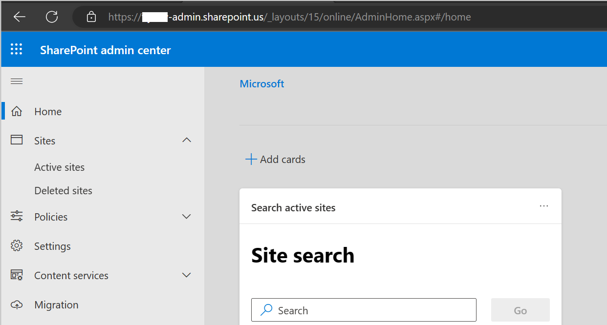
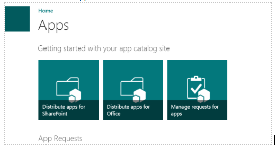
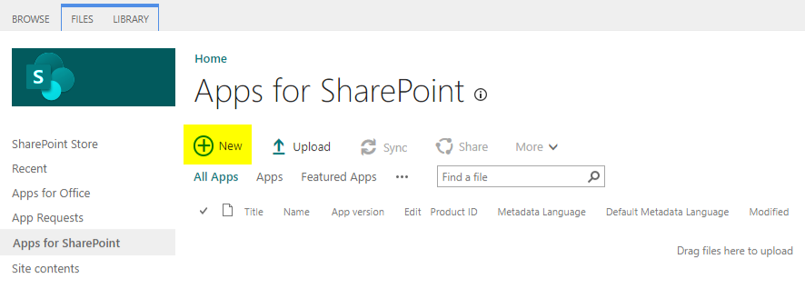
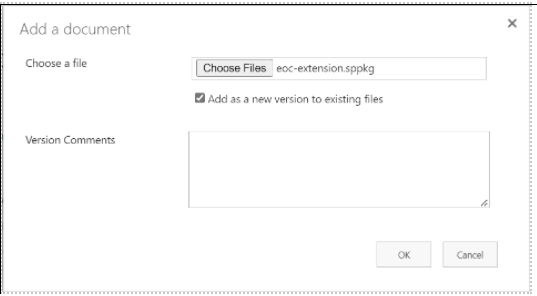
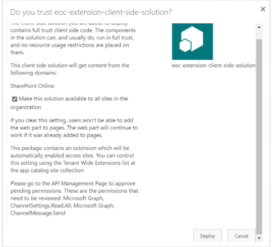

- Deployment Guide
    - [Prerequisites](#prerequisites) 
    - [Steps](#deployment-steps)
        - [Provisioning TEOC Site](#1-provisioning-teoc-site)
        - [Register AD Application](#2-register-azure-ad-application)
        - [Deploy to Azure subscription](#3-deploy-to-your-azure-subscription)
        - [Set-up Authentication](#4-set-up-authentication)
        - [Add Permissions to your app](#5-add-permissions-to-microsoft-graph-azure-ad-app)
        - [Add Permissions for Office 365 Exchange Online](#6-add-permissions-for-office-365-exchange-online)
        - [Create the Teams app packages](#7-create-the-teams-app-packages)
        - [Install the app in Microsoft Teams](#8-install-the-app-in-microsoft-teams)
        - [Verify M365 group creation policy in Azure Portal](#9-verify-m365-group-creation-policy-in-azure-portal)
        - [Deploy NotifyToTeams Extension in SharePoint](#10-deploy-notifytoteams-extension-in-sharepoint)
    - [Troubleshooting](#troubleshooting)
- - -

# Prerequisites

To begin deployment for Microsoft Teams Emergency Operations Center (TEOC) application, you will need: 
* An Azure subscription where you can create the following kinds of resources:
    * App Service
    * App Service Plan
    * Application Insights
    * App Registration

* You need minimum of contributor access to the Azure subscription to perform the deployment.

* To run the TEOC Provision PnP PowerShell script, you'll need PowerShell version 7.x or newer. This version is compatible with Windows, Linux, and Mac, and you can download it [installed through here](https://learn.microsoft.com/en-us/powershell/scripting/install/installing-powershell?view=powershell-7.4).

* For those who have previously installed PnP PowerShell, please ensure your version is 2.12.0 or newer. Here's the command to verify the version of PnP PowerShell you're currently using.
    ```
    get-Module -Name PnP.PowerShell -ListAvailable | select-Object -Property Name, Version, Path
    ```
- - -

# Deployment Steps

## 1. Provisioning TEOC Site

### Azure App Registration for PnP PowerShell

* Open a new PowerShell console (v7.x) as an administrator (right-click, Run As Administrator). Ensure unrestricted execution policy with the following:
    ```
    Set-ExecutionPolicy -ExecutionPolicy RemoteSigned
    ```
* Ensure the PnP.PowerShell module is loaded with the following:
    ```
    Import-Module -Name PnP.PowerShell
    ```
    If you have multiple versions of PnP.PowerShell installed, target a latest version with the -RequiredVersion flag.

* Run the following script ONCE per tenant to create an Azure App Registration for PnP:

    Login with user credentials that is assigned with Global Administrator role.
If you have previously registered PnP.PowerShell, check the App Registration in the Azure portal and make sure it has delegated permissions for AllSites.FullControl and User.Read.All. Also make sure that you've granted consent as an Administrator.
    >Note: Replace tenant with your tenant name.
    ```
    Register-PnPAzureADApp -ApplicationName "PnP PowerShell" -Tenant [TENANT].onmicrosoft.us -Interactive `
    -AzureEnvironment USGovernmentHigh -SharePointDelegatePermissions AllSites.FullControl, User.Read.All
    ```
    Please check the [Troubleshooting](Troubleshooting) guide to install the prerequisites, if you face any issues in running the above command.
* Provide consent on behalf of your organization

    

* Make a note of the **AzureAppId/ClientId** GUID returned from above step as it will be needed in the below step to provision the SharePoint site. This is the **ClientId** of the new PnP PowerShell Azure App Registration.

### Run the PnP Provisioning script
To provision the SharePoint site and lists for the TEOC app, 

* Clone the TEOC [repository](https://github.com/OfficeDev/microsoft-teams-emergency-operations-center.git) locally.
* Open the `Deployment/provisioning` folder to get the latest provisioning files i.e `EOC-ProvisionGCCH.ps1` and `EOC-SiteTemplate.xml`
* Open a PowerShell console as an administrator (right-click, Run As Administrator). Run the below command to unblock the deployment script.
    >Note: File path should be set to provisioning folder. 
    ```
    Unblock-File -Path .\EOC-ProvisionGCCH.ps1
    ```

Below are the steps you need to perform to provision the TEOC site,  

1. Run the PowerShell script as Administrator, script will ask for below inputs,
    
    * XML file path – Enter fully qualified path of the XML file (Ex: C:/Scripts/EOC-SiteTemplate.xml) 
    * Tenant Name – Name of the tenant where root TEOC site needs to be provisioned (Ex: Contoso)
    * Tenant Admin Email – Email of tenant admin account (Ex: `abc@contoso.com`) 
    * Azure App Id / Cient Id - The client Id of the PnP PowerShell Azure App Registration from the above step.
    * SharePoint Site Name - Name of the site that needs to be provisioned for TEOC application (Ex: TEOCSite)
    >Note: Make a note of the site name _without spaces_ (i.e. The internal name of the site, which is shown in the URL - Ex: **TEOCSite**), this will be needed later while deploying the resources in Step #3.

    

2. Once the above details are provided, script will check if the “PnP.PowerShell” module is installed, if not, it will install the module.
3. If you are running the **PnP.PowerShell** scripts for the first time for that tenant, it will ask for a list of permissions to be granted. 
    >Note: _PnP.PowerShell_ module requests for all the permissions that are there even if it is not used in the script to ensure smooth running of the scripts. These are delegated permissions, please make sure the user running the script have permissions to perform the action for the script to be executed successfully.

4. Below is the list of permissions it asks,

    

5. Only SharePoint related permission **Have full control of all site collections** will be utilized in the script so that the site can be provisioned.

6. Please make sure to grant permissions to users who need to use TEOC application, follow the below steps provide permissions,
    -   Navigate to the URL for the TEOC site as the administrator.
    -   If you are using the default configuration, this can be found at _`https://<yourtenant>.sharepoint.us/sites/<SiteName>/`_.
        - Select site permissions

            

        - Advanced permissions settings

            

        - Select Grant permissions 

            

        - Enter in 'Everyone except external users'        

            
        
        >Note: In case access has to be given to specific users, enter specific users instead of directly adding 'Everyone except external users' group.

        - Change permissions to 'TEOC Members [Edit]'
        - Unselect send an email invitation
        - Click share

## 2. Register Azure AD application

You need to first create a new Azure AD Application to secure API permissions. Registering your application establishes a trust relationship between your app and the Microsoft identity platform. 

1. Log in to the Azure Portal using SharePoint Tenant account where you want the app to be installed, and go to the [App registrations](https://portal.azure.us/#blade/Microsoft_AAD_IAM/ActiveDirectoryMenuBlade/RegisteredApps) blade.

1. Click **New registration** to create an Azure AD application.
    - **Name**: Name of your Teams App.
    - **Supported account types**: Select "Accounts in single organizational directory"
    - Leave the "Redirect URI" field blank for now.

    

1. Click **Register** to complete the registration.
1. When the app is registered, you'll be taken to the app's "Overview" page. Copy the **Application (client) Id and Tenant Id**; we will need it later. 

    

1. On the side rail in the Manage section, navigate to the "Certificates & secrets" section. In the Client secrets section, click on "+ New client secret". Add a description for the secret, and choose when the secret needs to expire (recommended is 12 months) and click "Add".

1. Once the client secret is created, copy its **Value** only; we will need it later. Once you leave this page, you may not be able to copy it again.

    

1. You're done with app registration and client secrets for now. This provides the groundwork for our next steps. Please ensure you have the values ready for Application Id, Tenant Id, Client Secret Value.

## 3. Deploy to your Azure subscription
1. Click on the **Deploy to Azure** button below.

    [](https://portal.azure.us/#create/Microsoft.Template/uri/https%3A%2F%2Fraw.githubusercontent.com%2FOfficeDev%2Fmicrosoft-teams-emergency-operations-center%2Fmain%2FDeployment%2Fazuredeploygcch.json)

1. When prompted, log in to your Azure subscription.

1. Azure will create a "Custom deployment" based on the TEOC ARM template with pre-filled values.

1. Select a subscription and a resource group.
   * We recommend creating a new resource group.
   * The resource group location MUST be in a datacenter that supports the following resources, click [here](https://azure.microsoft.com/en-us/global-infrastructure/services/?products=logic-apps,cognitive-services,search,monitor) to know more about the datacenter and the resources:

     * App Service
     * Application Insights

1. Enter a **Base Resource Name**, which the template uses to generate names for the other resources.
   * The `[Base Resource Name]` must be unique and available. For example, if you select `contosoteoc` as the base name, the name `contosoteoc` must be available (not taken); otherwise, the deployment will fail with a Conflict error.
   * Remember the base resource name that you selected. We will need it later.

   > **Note:** Please ensure that you use lower case and numbers in the field you enter, otherwise the deployment may fail.

1. Update the following fields in the template using the values copied from step 1 & 2 in previous section,
    1. **Client ID**: The application (client) ID of the app registered
    2. **Client Secret**: The client secret Value of the app registered
    3. **Tenant Id**: The tenant Id
    4. **Share Point Site Name**: Name of the SharePoint site that was provisioned in step 1 
       > Note: Add just the site name and not the entire URL. For example, if the URL of your sharepoint site is 'https://example.sharepoint.com/sites/TEOCSite' add just "TEOCSite"

1. Other fields have pre-populated default values, do not change it unless you want it to be customized depending on the need.

    

1. Click on **Review+Create**. Post successful validation clicks on Create. The deployment will take around 30 to 40 Minutes. Please wait for the deployment to be completed and then proceed with the below steps. 

## 4. Set-up Authentication

1. Go to **App Registrations** page [here](https://portal.azure.us/#blade/Microsoft_AAD_IAM/ActiveDirectoryMenuBlade/RegisteredApps) and select the application (TEOC specific) which you created in step 1. Follow the below steps to set up the authentication for the application.

    > Note: For following steps you need to use **appDomain** convention for the app service URL.
     - appDomain is the App service URL without https:// or <<**baseResourceName**>>.azurewebsites.us

  
1. Under **Manage**, click on **Authentication** to bring up authentication settings.

    1. Click on **Add a Platform**. Select Web and add Redirect URIs in below format:
        - **Redirect URI**: Enter `https://%appDomain%/auth-end.html` for the URL (Ex: `https://<<baseResourceName>>.azurewebsites.us/auth-end.html`)

    1. Click on **Add a Platform**. Select Single-page application and add Redirect URIs in below format:
        - **Redirect URI**: Enter `https://%appDomain%/auth-end.html?clientId= %clientId%` for the URL (Ex: `https://<<baseResourceName>>.azurewebsites.us/auth-end.html?clientId=<<Client Id>>`)
        - Click on Add URI and add another entry as, `https://%appDomain%/blank-auth-end.html` (Ex: `https://<<baseResourceName>>.azurewebsites.us/blank-auth-end.html`)     

    1. Click **Save** to commit your changes.

        

    1. Back under **Manage**, click on **Expose an API**.

    1. Click on the **Set** link next to **Application ID URI**, and change the value to `api://%appDomain%/%clientId%` (Ex: `api://<<baseResourceName>>.azurewebsites.us/<<Client Id>>`.

    1. Click **Save** to commit your changes.

    1. Click on **Add a scope**, under **Scopes defined by this API**. In the flyout that appears, enter the following values:
        * **Scope name:** access_as_user 
        > Note: Enter Scope name as _access_as_user_, otherwise it may throw 403 forbidden error while logging in to the app
        * **Who can consent?:** Admins and users
        * **Admin consent display name:** Teams can access app’s web APIs
        * **Admin consent description:**  Allows Teams to call the app’s web APIs as the current user.

    1. Click **Add scope** to commit your changes.

        

    1. Click **Add a client application**, under **Authorized client applications**. In the flyout that appears, enter the following values:
        * **Client ID**: `5e3ce6c0-2b1f-4285-8d4b-75ee78787346` (_Teams WebApp Client Id_)
        > Note: This Id is different than the Client Id from step 2 
        * **Authorized scopes**: Select the scope that ends with `access_as_user`. (There should only be 1 scope in this list.)

    1. Click **Add application** to commit your changes.

    1. **Repeat the previous two steps**, but with below Ids.
        * 1fec8e78-bce4-4aaf-ab1b-5451cc387264 (_Teams Mobile or Desktop App Client Id_)
        * 4345a7b9-9a63-4910-a426-35363201d503 (_Office WebApp Client Id1_)
        * 4765445b-32c6-49b0-83e6-1d93765276ca (_Office WebApp Client Id2_)
        * d3590ed6-52b3-4102-aeff-aad2292ab01c (_Outlook Desktop App Client Id_)
        * 00000002-0000-0ff1-ce00-000000000000 (_Outlook Web App Client Id_)

    1. After this step you should have **6** client applications listed under **Authorized client applications**.

        

1. Back under **Manage**, click on **Manifest**.
    1. In the editor that appears, find `accessTokenAcceptedVersion` and update the value from **null** to **2**
    2. Find the `optionalClaims` property in the JSON Azure AD application manifest, and replace it with the following block:
    ```
        "optionalClaims": {
            "idToken": [],
            "accessToken": [
                {
                    "name": "idtyp",
                    "source": null,
                    "essential": false,
                    "additionalProperties": []
                }
            ],
            "saml2Token": []
        },
    ```    
    3. Click **Save** to commit your changes.

        

## 5. Add Permissions to Microsoft Graph Azure AD app

In this section, you’ll be adding the necessary Graph API permissions to the application. 

1. Select **API Permissions** blade from the left hand side.

2. Click on **Add a permission** button to add permission to your app.

3. In the fly out, click **Microsoft Graph**, then select **Delegated permissions** and enter the following permissions one by one,

    *  Directory.AccessAsUser.All
    *  Group.ReadWrite.All
    *  People.Read
    *  Sites.Manage.All
    *  TeamMember.ReadWrite.All 
    *  TeamsTab.Create
    *  TeamworkTag.ReadWrite
    *  User.Read
    *  User.ReadBasic.All
    *  Tasks.Read
    *  Tasks.ReadWrite
    *  Group.Read.All
    *  OnlineMeetings.ReadWrite
    *  TeamsAppInstallation.ReadWriteSelfForTeam
    *  Mail.Send
    *  AppCatalog.Read.All

4. Click on **Add Permissions** to commit your changes. 
5. Below is the description/reason for each permission granted above, 

    1.  **Directory.AccessAsUser.All** : Allows the app to have the same access to information in the directory as the signed-in user. TEOC app uses this permission to access the Teams, SharePoint and Users information in the app. 
    2.  **Group.ReadWrite.All** : Allows the app to create groups, read and update group memberships, and delete groups. Also allows the app to read and write calendars, conversations, files, and other group content for all groups. All these operations can be performed by the app without a signed-in user. TEOC app uses this permission to create a group when the incident is created.
    3.  **People.Read** : Allows the app to read a scored list of people relevant to the signed-in user. The list can include local contacts, contacts from social networking or your organization's directory, and people from recent communications (such as email and Skype). TEOC app uses this permission for the “People Picker” fields to work (for ex. - Incident Commander and Role assigned user). 
    4.  **Sites.Manage.All** : Allows the app to manage and create lists, documents, and list items in all site collections on behalf of the signed-in user. TEOC app uses this permission to create the lists in the site created for each incident.
    5.  **TeamMember.ReadWrite.All** : Add and remove members from teams, on behalf of the signed-in user. Also allows changing a member's role, for example from owner to non-owner. TEOC app uses this permission to update the Teams membership when updating a role. 
    6.  **TeamsTab.Create** : Allows the app to create tabs in any team in Microsoft Teams, on behalf of the signed-in user. This does not grant the ability to read, modify or delete tabs after they are created, or give access to the content inside the tabs. TEOC app uses to create the tabs in the team created for the incident. 
    7.  **TeamworkTag.ReadWrite** :  Allows the app to read and write tags in Teams without a signed-in user. TEOC app uses this permission to create and update the tags which gets created along with the incident. 
    8.  **User.Read** : Allows users to sign-in to the app and allows the app to read the profile of signed-in users. It also allows the app to read basic company information of signed-in users. TEOC app uses to get the current user details in the app. 
    9.  **User.ReadBasic.All** : Allows the app to read a basic set of profile properties of other users in your organization on behalf of the signed-in user. TEOC app uses this permission search for other users and assign them roles while creating the incident.
    10. **Tasks.Read** : Allows the app to read the signed-in user's tasks and task lists, including any shared with the user. Doesn't include permission to create, delete, or update anything. TEOC app uses this permission to read the planner tasks of the signed in users, including any shared with the user.
    11. **Tasks.ReadWrite** : Allows the app to create, read, update, and delete the signed-in user's tasks and task lists, including any shared with the user.TEOC app uses this permission to create, read, update, and delete the planner tasks of the signed-in users, including any shared with the user.
    12. **Group.Read.All** : Allows the app to list groups, and to read their properties and all group memberships on behalf of the signed-in user. Also allows the app to read calendar, conversations, files, and other group content for all groups the signed-in user can access. TEOC app uses this permission for fetching and reading tasks as it has Microsoft Planner data source configured for Tasks component.
    13. **OnlineMeetings.ReadWrite** : Allows an app to create, read online meetings on behalf of the signed-in user. TEOC app uses this permission to create and join bridge (instant meeting) on behalf of the signed-in user.
    14. **TeamsAppInstallation.ReadWriteSelfForTeam** : Allows a Teams app to read, install, upgrade, and uninstall itself to teams the signed-in user can access. TEOC app uses this permission to install and read the Tab apps in the incident team.
    15. **Mail.Send** : Allows the app to send mail as users in the organization. TEOC app uses this permission to send a welcome email to guest users for joining incident team.
    16. **AppCatalog.Read.All** : Allows the app to read the apps in the app catalogs. TEOC app uses this permission to read the app id of the TEOC app to add it as a tab on the General channel of the incident team.

5. Reach out to your IT admin team to grant consent for the permissions provided. If you’re an admin, click on Grant the admin Consent for ******* 

    

## 6. Add Permissions for Office 365 Exchange Online 

In this section, you’ll be adding the Office 365 Exchange Online API permissions to the application.

1. Select **API Permissions** blade from the left hand side.

2. Click on **Add a permission** button to add permission to your app.

3. In the fly out, click **Office 365 Exchange Online**, then select **Delegated permissions** and enter the following permission
    *  Calendars.Read

4. Click on **Add Permissions** to commit your changes. 
5. This permission reads the user calendar and provides suggestions for the Location picker while creating the incident.
6. Reach out to your IT admin team to grant consent for the permissions provided. If you’re an admin, click on Grant the admin Consent for *******

    


## 7. Create the Teams app packages

Now we build the teams package to upload the TEOC (Teams Emergency Operations Center) app to the Teams client. TEOC in turn will connect to the SharePoint resources/list to the Tenant deployed. 

To create the team's package, 

1. Make sure you have cloned the app [repository](https://github.com/OfficeDev/microsoft-teams-emergency-operations-center.git) locally.

1. Open the `Deployment\appPackage\manifest.json` file in a text editor.
    
1. Change the `<<appDomain>>` placeholder in the below settings to your app domain URL, for example    
        
    * `"configurationUrl": "https://<<appDomain>>/index.html#/config"`
    * `"contentUrl": "https://<<appDomain>>/index.html#/tab"`
 
1. Change the `<<websiteUrl>>` placeholder in the below setting to the URL of the TEOC SharePoint site

    * `"websiteUrl": "https://<<websiteUrl>>"`

    

1. Update the validDomains and webApplicationInfo details.

    * Change the `<<clientId>>` placeholder in the webApplicationInfo setting with the _%clientId%_. This is the application id which we copied in step 2.

    * Change the `<<appDomain>>` placeholder in the _webApplicationInfo_ and _validDomains_ to the `%appDomain%` value.  

    ```
      "validDomains": [ 
            "<<appDomain>>" 
        ], 
    ```
    ```
        "webApplicationInfo": { 
            "id": "<<clientId>>", 
            "resource": "api://<<appDomain>>/<<clientId>>" 
        } 
     ```

    

1. Create a ZIP package with the manifest.json and resources folder with color.png, and outline.png. The two image files are the icons for your app in Teams.

    * Name this package `teoc.zip`, so you know that this is the app for the TEOC teams. 

    * Make sure that the files are the top level of the ZIP package, with no nested folders. 
    
    

  
## 8. Install the app in Microsoft Teams

1. Upload the app (the teoc.zip package) to Teams. 

1. If your tenant has sideloading apps enabled, you can install your app by following the instructions [here](https://docs.microsoft.com/en-us/microsoftteams/platform/concepts/apps/apps-upload#load-your-package-into-teams) 

1. You can also upload it to your tenant's app catalog so that it can be available for everyone in your tenant to install. See [here](https://docs.microsoft.com/en-us/microsoftteams/tenant-apps-catalog-teams) 

    > Note: Please review [app permission policies](https://learn.microsoft.com/en-us/microsoftteams/manage-apps#manage-org-wide-app-settings-for-microsoft-365-government) to allow access to the app.


## 9. Verify M365 group creation policy in Azure Portal

1. Log in to the Azure Portal in the tenant where the TEOC app registration is done.

2. Navigate to Groups, check for the setting "Users can create Microsoft 365 groups in Azure portals, API or PowerShell".

    

3. If it is set to **No**, then follow this [documentation](https://learn.microsoft.com/en-us/microsoft-365/solutions/manage-creation-of-groups?view=o365-worldwide) to create a M365 group that can be used to control who is able to create Microsoft 365 Groups in the tenant and add the users from your organization who will be creating incidents in the TEOC application to that M365 group.

4. If it is set to **Yes**, no action is required.

## 10. Deploy “NotifyToTeams” Extension in SharePoint

1. To get the latest package for extension, make sure you have cloned the app [repository](https://github.com/OfficeDev/microsoft-teams-emergency-operations-center.git) locally.  

1. Get the latest package file `“eoc-extension.sppkg”` under **EOC-Extensions/sharepoint/ solution** folder.  

    

1. Below are the steps you need to perform to add **NotifyToTeams** extension in TEOC site.

1. Open SharePoint admin center.

    

1. Click on **More features** menu item. Locate the Apps section and click the Open button.

    

1. Click on **App Catalog** link. 

    

    _If you do not see an app catalog available, use the instructions [here](https://docs.microsoft.com/en-us/sharepoint/use-app-catalog#step-1-create-the-app-catalog-site-collection) to create a new app catalog before continuing._

1. Click the Distribute apps for SharePoint link.

    

1. Click the New option.

    

1. Click the Choose Files button, select the eoc-extension.sppkg file you downloaded or created earlier, and click on OK.

    

1. A confirmation dialog is displayed. Ensure the checkbox for **Make this solution	available to all sites in the organization** is chosen and click Deploy.

     

1. Return to the SharePoint admin center. Under expand the Advanced menu in the left navigation and select API access. Select and approve all pending requests 	associated with eoc-extension.

    

# Troubleshooting

Please check the [Troubleshooting](Troubleshooting) guide.
