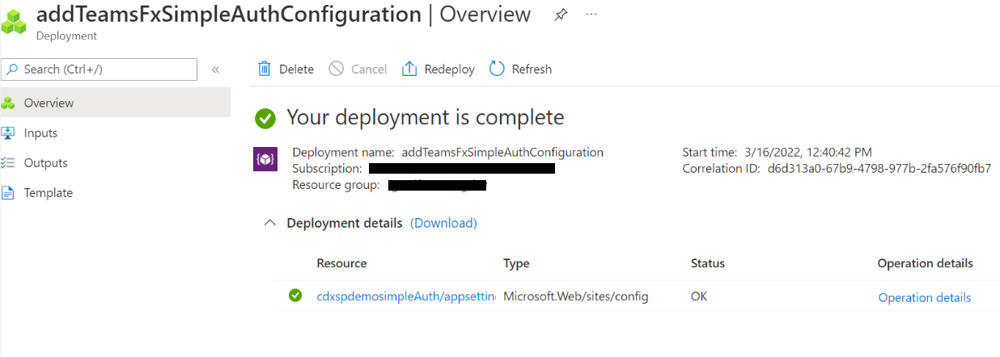
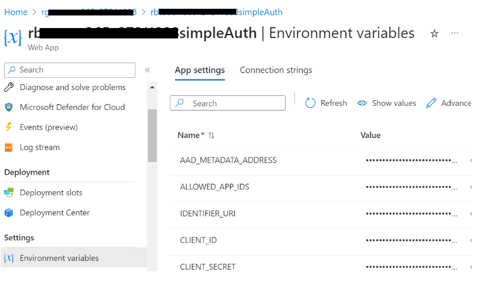

# General Template issues

## Problems deploying to Azure

### 1. App service name already exists

`Website with given name <name> already exists.`

`Creating resources of type "Microsoft.Web/sites" failed with status "Conflict"`

This happens when Azure web apps with the name `[BaseResourceName]` or `[BaseResourceName]-config` already exist.

### Fix

Choose a different "Base Resource Name". You can check if your desired name is available by going to the page to [create a new web app](https://portal.azure.com/#create/Microsoft.WebSite) in the Azure Portal. Enter your desired name in the "App name" field. An error message will appear if the name you have chosen is taken or invalid.

### 2. Resource location doesn't support Application Insights

`The subscription is not registered for the resource type 'components' in the region '<region>'. Please re-register for this provider in order to have access to this location.`

`Creating resources of type "microsoft.insights/components" failed with status "Conflict"`

This happens when Application Insights is not available in the Azure datacenter location where you chose to create the app.

### Fix

Create the resource group in a location where Application Insights is available. For an up-to-date list of these locations, refer [here](https://azure.microsoft.com/en-us/global-infrastructure/services/?products=monitor), under "Application Insights".

### 3. Deployment failed with one or more resource as 'Conflict'

Click on the Operation details, check for the error message. If the error message is **Gateway error**, this can occur due to network issues.


### Fix

* If multiple resources failed due to same error, recommendation is to clear out the existing resources and re-deploy the template from start.
* If anyone resource has failed like _addTeamsFxSimpleAuthConfiguration_,

    * Click on the failed resource template. 
    * Click on Redeploy as template for the specific resource can be re-deployed separately.
    * Provide the parameters specific to the template.
    * Verify if the deployment has been successful.

        


## Problems installing the app in Teams

### 1. Missing entrypoint to upload custom app

You don't see the entry points to upload an app, either using the [Store](https://docs.microsoft.com/en-us/microsoftteams/platform/concepts/apps/apps-upload#upload-your-package-into-a-team-or-conversation-using-the-store) or using the [Apps tab](https://docs.microsoft.com/en-us/microsoftteams/platform/concepts/apps/apps-upload#upload-your-package-into-a-team-using-the-apps-tab).

This is most likely because sideloading of external apps is not enabled in your tenant. See [here](https://docs.microsoft.com/en-us/microsoftteams/admin-settings) for more information.

## Problems in running PowerShell Script

### 1. Error in registering PnP Powershell App in Azure.

If you see any errors related to missing PnP PowerShell modules, ensure to install these pre-requisites and try again.

### Prerequisites to run the PowerShell Script

You only need to follow these steps ONCE for a specified Windows machine.

* Open a PowerShell console as an administrator (right-click, Run As Administrator).
    >Note: The latest version of PnP.PowerShell is cross-platform and works with PowerShell Core (v7.x).
* Ensure unrestricted execution policy is set in your machine. By default, the execution policy is restricted for windows computer. You may change it back to restricted after deployment is completed.
    >Note: Non-windows computer users can skip this as it is unrestricted by default for them.
    ```
    Set-ExecutionPolicy -ExecutionPolicy RemoteSigned
    ```

* Check the installed version of PowerShellGet with the following cmdlet:
    ```
    Get-PackageProvider -Name PowerShellGet -ListAvailable​
    ```
* If you see version 2.2.5.0 or greater, skip the next two bullets.
    >Note: If you have PowerShell 5.1 and 7.x installed, you may have different versions of PowerShellGet for each version of PowerShell.
* Install the required version of PowerShellGet with:
    ```
    Install-PackageProvider -Name Nuget -Scope AllUsers -Force
    Install-PackageProvider -Name PowerShellGet -MinimumVersion 2.2.5.0 -Scope AllUsers -Force​
    ```
* Close and reopen your PowerShell console (again, as an administrator).
* Install PnP.PowerShell with the following:
    ```
    Install-Module -Name PnP.PowerShell -AllowPrerelease -SkipPublisherCheck -Scope AllUsers -Force​
    ```
* Close and reopen your PowerShell console (run as administrator not required this time).
* Confirm that PnP.PowerShell is installed with the following:
    ```
    Get-Module -Name PnP.PowerShell -ListAvailable​
    ```

## Problems in Creating a New Incident

### 1. Create Incident fails with below error message:

**"An error has occurred, You do not have permission to create M365 groups which is required to create an incident. Please check with your tenant administrator."**

To be able to create incidents the users need to have permissions to create M365 groups. Refer to section **Verify M365 group creation policy in Azure Portal** in the deployment guide for additional details.


## Other Problems with the App

### 1. Client Secret Expiry

If the client secret for the TEOC App Registration expires the Dashboard shows Login button and nothing happens on click of Login button. Check Azure portal if Client Secret for the TEOC app registration expired. If yes, follow the below steps to create a new secret and update.

#### Generate new client secret
1. Open registered TEOC application from app registrations and generate new client secret from Certificates and secrets section. Copy new client secret Value. 


#### Update new client secret

1. Open azure portal and navigate to resource group created for TEOC. Open SimpleAuth app service which is created. 
Navigate to Environment variables or Configuration under settings which ever applies to your tenant.




1. Click show values and update value of new client secret and save. 


1. Once value is updated, navigate to Overview and Restart the app service. 


## Didn't find your problem here?

Please report the issue [here](https://github.com/OfficeDev/microsoft-teams-emergency-operations-center/issues/new)

